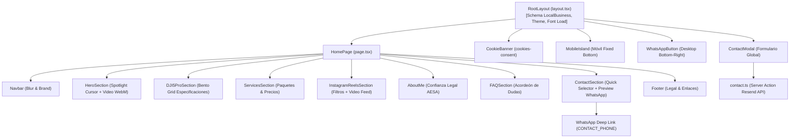
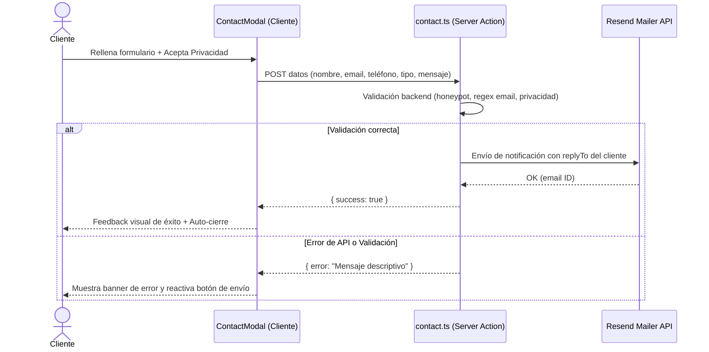

# 📐 Stage 02: Specs — Especificaciones Técnicas y de Diseño
*Entregable canónico de Stage 02 (`output/specs.md`) bajo metodología ICM.*

---

## 1. Stack Tecnológico & Decisiones de Arquitectura
* **Framework:** Next.js 15.5+ (App Router, Server Components y Server Actions).
* **UI Runtime:** React 19 + TypeScript (strict mode).
* **Motor de Estilos:** Tailwind CSS v4 con configuración `@theme` nativa en `src/app/globals.css`.
* **Animaciones & Motion:** Framer Motion (`framer-motion` v12) con transiciones basadas en física de resortes y easings de Emil Kowalski (`cubic-bezier(0.16, 1, 0.3, 1)`).
* **Linters & Tooling:** Biome (`@biomejs/biome`) para formateo y análisis estático ultrarrápido sin ESLint/Prettier legacy.

---

## 2. Diagrama de Arquitectura de Componentes

---

## 3. Tokens de Diseño y Estética Visual (Brand Kit)
*Referencia directa: [`DESIGN.md`](file:///C:/Users/rgs84/DRONES/DESIGN.md)*

### Paleta Cromática
* **`--bg-root`:** `#050505` (Space Black / Modo oscuro cinemático profundo).
* **`--surface-card`:** `#0f1115` (Titanium Dark).
* **`--brand-accent`:** `gold-400` (`#dfd0a4`) y escala de degradado dorada (`#f0e6c8` > `#dfd0a4` > `#c8b88a`).
* **`--accent-glow`:** `#22d3ee` (Cian telemétrico para datos de altitud/GPS).

### Jerarquía Tipográfica Consolidada
1. **Titulares (H1/H2):** *Cormorant Garamond* (editorial cinematográfico) y *Cinzel* (marca).
2. **Cuerpo y UI:** *Plus Jakarta Sans* (lectura limpia, `font-light` en párrafos, `font-semibold` en microcopys).
3. **Métricas y Telemetría:** `font-mono` con soporte `tabular-nums` para coordenadas y datos de vuelo.

---

## 4. Contratos de Datos y Flujos de Conversión

### 4.1. Single Source of Truth para Contacto
* **Archivo:** `src/lib/config.ts`
* **Variable:** `CONTACT_PHONE` (`34645228514`)
* **Regla:** Queda prohibido escribir cadenas fijas de teléfono en componentes individuales. Toda llamada o enlace externo a WhatsApp debe importar `CONTACT_PHONE`.

### 4.2. Flujo de Captura de Leads (Server Action)

---

## 5. Decisiones de Rendimiento y Mobile-First
1. **Lazy Loading de Videos:** Elementos `<video>` bajo el hero configurados con `preload="none"` para evitar colapso de GPU y buffers innecesarios en iOS Safari.
2. **Ergonomía Táctil:**
   - En pantallas `< 768px`, el botón flotante tradicional de WhatsApp se oculta en favor de `MobileIsland.tsx`, proporcionando 3 accesos directos (WhatsApp, Showreel, Modal de contacto) en la zona natural del pulgar.
3. **Persistencia de Consentimiento:**
   - La clave unificada de almacenamiento local es `cookies-consent` para evitar bucles infinitos de comprobación.

